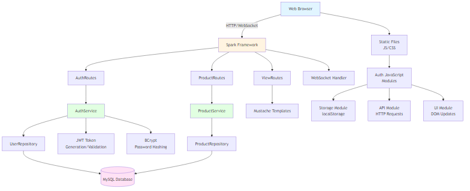
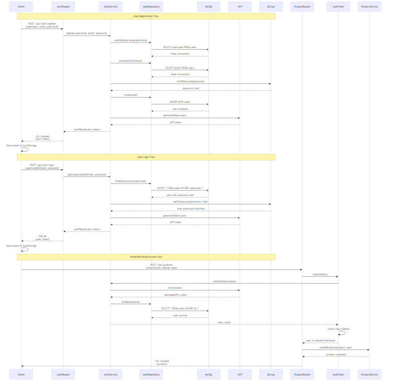
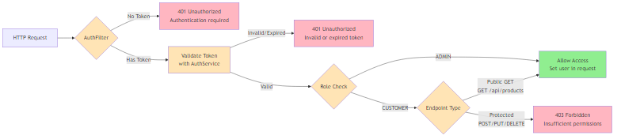

# Collectibles Store API

A RESTful e-commerce API for managing collectible items using Java and the Spark framework with MySQL database integration. This project implements a modern web service architecture following SOLID principles with proper error handling, validation, comprehensive documentation, and JWT-based authentication.

**🌐 Live Demo**: [https://collectibles-store-09ew.onrender.com](https://collectibles-store-09ew.onrender.com)

## 🚀 Project Overview

This project is part of the Digital NAO Backend Development pathway, focusing on implementing a web application for selling collectible items using Java and the Spark framework. The API provides comprehensive product management functionality with a clean, RESTful interface, proper route grouping, and secure authentication.

The application follows a layered architecture with clear separation of concerns: routes handle HTTP requests, services contain business logic, repositories manage data access, and models represent domain entities. Authentication is implemented using JWT tokens with role-based access control (RBAC), allowing different permission levels for administrators and customers.

### Key Features

- **RESTful API Design**: Clean, intuitive endpoints following REST principles
- **JWT Authentication**: Secure token-based authentication with role-based access control
- **Product Management**: Complete CRUD operations for collectible items with soft delete functionality
- **Real-Time Updates**: WebSocket support for live price updates across all connected clients
- **Web Interface**: Modern Mustache templates with admin panel and product browsing
- **MySQL Integration**: Robust database layer with connection pooling and migrations
- **Exception Handling**: Custom exception hierarchy with centralized error management
- **Environment Configuration**: Flexible configuration management with .env support
- **SOLID Principles**: Clean architecture following SOLID design principles
- **Input Validation**: Comprehensive data validation and error handling (SQL injection protection)
- **JSON API**: Full JSON support with proper serialization/deserialization
- **CORS Support**: Cross-origin resource sharing enabled for web clients
- **Database Migrations**: Automated schema management with Flyway
- **Connection Pooling**: High-performance database connections with HikariCP
- **Logging**: Comprehensive logging using Logback
- **Maven Build**: Standard Maven project structure with dependency management
- **Docker Support**: Containerized deployment ready
- **API Documentation**: Interactive API docs with Scalar
- **CI/CD Pipeline**: GitHub Actions workflow for automated testing and deployment
- **Comprehensive Testing**: Unit tests, integration tests, and code coverage reporting

## 📋 API Endpoints

### Authentication Endpoints

| Method | Endpoint | Description | Auth Required |
|--------|----------|-------------|---------------|
| `POST` | `/api/auth/register` | Register new user | No |
| `POST` | `/api/auth/login` | Login and get JWT token | No |
| `GET` | `/api/auth/me` | Get current user info | Yes |
| `POST` | `/api/auth/logout` | Logout (client-side) | No |

### Product Management (Core Operations)

| Method | Endpoint | Description | Auth Required |
|--------|----------|-------------|---------------|
| `GET` | `/api/products` | Retrieve all products with name and price | No |
| `GET` | `/api/products/:id` | Retrieve a specific product by ID with description | No |
| `POST` | `/api/products` | Create a new product | Yes (ADMIN) |
| `PUT` | `/api/products/:id` | Update an existing product | Yes (ADMIN) |
| `DELETE` | `/api/products/:id` | Soft delete a product | Yes (ADMIN) |
| `OPTIONS` | `/api/products/:id` | Check if a product exists | No |

### Advanced Product Operations

| Method | Endpoint | Description | Auth Required |
|--------|----------|-------------|---------------|
| `GET` | `/api/products/search?q=query` | Search products by name or description | No |
| `GET` | `/api/products/category/:category` | Get products by category | No |
| `GET` | `/api/products/price-range?min=min&max=max` | Get products by price range | No |
| `GET` | `/api/products/active` | Get active products only | No |
| `GET` | `/api/products/stats` | Get product statistics | No |
| `POST` | `/api/products/:id/restore` | Restore soft-deleted product | Yes (ADMIN) |
| `DELETE` | `/api/products/:id/hard` | Permanently delete a product | Yes (ADMIN) |

### Web Interfaces

| Page | Endpoint | Description |
|------|----------|-------------|
| `GET` | `/` | Home page |
| `GET` | `/products` | Browse products with filtering |
| `GET` | `/login` | Login page |
| `GET` | `/register` | Registration page |
| `GET` | `/admin/products` | Admin product management (create mode) |
| `GET` | `/admin/products/:id` | Admin product management (edit mode) |

### WebSocket Endpoints

| Endpoint | Description |
|----------|-------------|
| `/ws/prices` | Real-time price updates (WebSocket connection) |

### API Documentation

- **Interactive API Docs**: Available at `/api/docs` (Scalar UI)
- **OpenAPI Specification**: Available at `/api/openapi.json`

## 🛠️ Technology Stack

- **Java 17**: Core programming language
- **Spark Framework 2.9.4**: Lightweight web framework for Java
- **MySQL 8+**: Primary database
- **HikariCP 5.1.0**: High-performance connection pooling
- **Flyway 10.8.1**: Database migration management
- **Maven**: Dependency management and build automation
- **Gson 2.10.1**: JSON serialization/deserialization
- **Logback 1.4.14**: Logging framework
- **Mustache**: Server-side templating engine for views
- **Jetty WebSocket**: Real-time communication (included in Spark)
- **JWT (Auth0)**: JSON Web Token authentication
- **BCrypt**: Password hashing
- **JUnit 5**: Testing framework
- **Mockito**: Mocking framework for tests
- **JaCoCo**: Code coverage reporting
- **Docker**: Containerization
- **Scalar**: Interactive API documentation
- **Jest**: JavaScript testing framework (frontend)

## 📦 Project Structure

```
collectibles-store/
├── src/
│   ├── main/
│   │   ├── java/
│   │   │   └── com/
│   │   │       └── spark/
│   │   │           └── collectibles/
│   │   │               ├── Application.java                    # Main application class
│   │   │               ├── config/
│   │   │               │   └── EnvironmentConfig.java         # Environment configuration
│   │   │               ├── database/
│   │   │               │   ├── DatabaseConnectionManager.java # Database connection management
│   │   │               │   └── DatabaseMigrationManager.java  # Database migrations
│   │   │               ├── model/
│   │   │               │   ├── Product.java                   # Product model
│   │   │               │   └── User.java                      # User model
│   │   │               ├── repository/
│   │   │               │   ├── ProductRepository.java         # Repository interface
│   │   │               │   ├── UserRepository.java             # User repository interface
│   │   │               │   └── impl/
│   │   │               │       ├── MySQLProductRepository.java # MySQL implementation
│   │   │               │       └── MySQLUserRepository.java    # MySQL user implementation
│   │   │               ├── service/
│   │   │               │   ├── ProductService.java            # Business logic
│   │   │               │   ├── AuthService.java               # Authentication service
│   │   │               │   └── UserService.java               # User service
│   │   │               ├── routes/
│   │   │               │   ├── ProductRoutes.java             # API routes
│   │   │               │   ├── AuthRoutes.java                 # Authentication routes
│   │   │               │   ├── UserRoutes.java                # User routes
│   │   │               │   └── ViewRoutes.java                # View routes
│   │   │               ├── exception/
│   │   │               │   ├── CollectiblesException.java     # Base exception
│   │   │               │   ├── ProductNotFoundException.java  # Product not found
│   │   │               │   ├── ProductValidationException.java # Validation errors
│   │   │               │   ├── DuplicateProductException.java # Duplicate products
│   │   │               │   ├── DatabaseException.java         # Database errors
│   │   │               │   └── ExceptionHandler.java          # Exception handling
│   │   │               ├── websocket/
│   │   │               │   ├── PriceWebSocketHandler.java     # WebSocket handler
│   │   │               │   └── PriceUpdateMessage.java        # WebSocket messages
│   │   │               └── util/
│   │   │                   ├── JsonUtil.java                  # JSON utilities
│   │   │                   ├── ErrorHandler.java              # Error utilities
│   │   │                   ├── ValidationUtil.java            # Validation utilities
│   │   │                   ├── AuthFilter.java                 # Authentication filter
│   │   │                   └── LocalDateTimeAdapter.java      # Date/time serialization
│   │   └── resources/
│   │       ├── application.properties                         # Application configuration
│   │       ├── logback.xml                                   # Logging configuration
│   │       ├── static/
│   │       │   └── js/
│   │       │       └── auth/                                  # Modular auth JavaScript
│   │       │           ├── index.js                           # Main aggregator
│   │       │           ├── api.js                             # API calls
│   │       │           ├── storage.js                          # localStorage helpers
│   │       │           └── ui.js                               # DOM updates
│   │       ├── templates/                                    # Mustache templates
│   │       │   ├── products.mustache                         # Product browsing page
│   │       │   ├── login.mustache                           # Login page
│   │       │   ├── register.mustache                         # Registration page
│   │       │   ├── admin/
│   │       │   │   └── product-form.mustache                # Admin form
│   │       │   └── error.mustache                            # Error pages
│   │       └── db/
│   │           └── migration/                                # Database migration scripts
│   │               ├── V1__Create_products_table.sql
│   │               ├── V2__Insert_sample_products.sql
│   │               └── V3__Create_users_table.sql
│   └── test/
│       ├── java/                                             # Test classes
│       │   ├── service/                                     # Service unit tests
│       │   ├── routes/                                       # Route unit tests
│       │   ├── util/                                        # Utility tests
│       │   └── integration/                                  # Integration tests
│       └── js/                                               # JavaScript tests
│           └── auth/                                         # Auth JS tests
├── docs/                                                     # Project documentation
│   ├── openapi.json                                         # OpenAPI specification
│   ├── backlog.md                                           # Project backlog
│   ├── roadmap.md                                            # Development roadmap
│   ├── diagrams/                                             # Architecture diagrams
│   │   ├── system-architecture.mmd                           # System architecture
│   │   ├── auth-flow.mmd                                     # Authentication flow
│   │   └── role-access.mmd                                   # Role-based access
│   └── TESTS-README.md                                       # Testing documentation
├── .github/
│   └── workflows/
│       └── ci-cd.yml                                        # GitHub Actions workflow
├── pom.xml                                                   # Maven configuration
├── package.json                                              # Node.js dependencies (tests)
├── Dockerfile                                               # Docker configuration
├── README.md                                                # This file
├── CONTRIBUTING.md                                          # Contribution guidelines
├── CODE_DOCS.md                                             # Code documentation guide
├── run.bat                                                  # Windows run script
└── run.sh                                                   # Unix/Linux run script
```

## 🚀 Getting Started

### Prerequisites

- **Java 17** or higher
- **Maven 3.6** or higher
- **MySQL 8** or higher
- **Node.js 18+** (for frontend tests)
- **Docker** (optional, for containerized deployment)
- **Git** (for version control)

### Installation

1. **Clone the repository**
   ```bash
   git clone https://github.com/alduinocalderon/collectibles-store.git
   cd collectibles-store
   ```

2. **Set up MySQL database**
   ```bash
   # Create database using MySQL client
   mysql -u root -p -e "CREATE DATABASE collectibles_store;"
   
   # Or login to MySQL and create database
   mysql -u root -p
   CREATE DATABASE collectibles_store;
   ```

3. **Configure environment variables**
   ```bash
   # Set environment variables (optional - defaults are in application.properties)
   export DB_HOST=localhost
   export DB_PORT=3306
   export DB_NAME=collectibles_store
   export DB_USERNAME=root
   export DB_PASSWORD=your_password
   
   # Required for authentication (minimum 32 characters)
   export JWT_SECRET=your-secret-key-here-minimum-32-characters-very-important
   export JWT_EXPIRATION_HOURS=24
   ```

4. **Build the project**
   ```bash
   mvn clean compile
   ```

5. **Run the application**
   ```bash
   mvn exec:java -Dexec.mainClass="com.spark.collectibles.Application"
   ```
   
   Or build and run the JAR:
   ```bash
   mvn clean package
   java -jar target/collectibles-store-1.0.0.jar
   ```

6. **Access the application locally**
   - Home Page: `http://localhost:4567`
   - Products Browser: `http://localhost:4567/products`
   - Login Page: `http://localhost:4567/login`
   - Register Page: `http://localhost:4567/register`
   - Admin Panel: `http://localhost:4567/admin/products`
   - Interactive API Docs: `http://localhost:4567/api/docs`
   - OpenAPI Spec: `http://localhost:4567/api/openapi.json`

**Or access the live deployed version**:
   - 🌐 **Demo Site**: [https://collectibles-store-09ew.onrender.com](https://collectibles-store-09ew.onrender.com)
   - 📊 **API Docs**: [https://collectibles-store-09ew.onrender.com/api/docs](https://collectibles-store-09ew.onrender.com/api/docs)
   - 📄 **API Spec**: [https://collectibles-store-09ew.onrender.com/api/openapi.json](https://collectibles-store-09ew.onrender.com/api/openapi.json)

### Docker Deployment

1. **Build Docker image**
   ```bash
   docker build -t collectibles-store .
   ```

2. **Run with Docker Compose**
   ```bash
   docker-compose up -d
   ```

3. **Run standalone container**
   ```bash
   docker run -p 4567:4567 \
     -e DB_HOST=your-db-host \
     -e DB_PASSWORD=your-password \
     -e JWT_SECRET=your-secret-key \
     collectibles-store
   ```

## 🧪 Testing

The project includes comprehensive test coverage for both backend (Java) and frontend (JavaScript). See [TESTS-README.md](docs/TESTS-README.md) for detailed testing documentation.

### Running Backend Tests

```bash
# Run all unit tests (excludes integration tests by default)
mvn test

# Run tests with coverage report
mvn clean test jacoco:report

# View coverage report (Windows)
start target/site/jacoco/index.html

# Run integration tests (requires MySQL)
mvn test -Dtest="**/*Test"
```

**Test Reports:**
- **Test Results:** `target/surefire-reports/` (XML/text format)
- **Coverage Report:** `target/site/jacoco/index.html` (HTML format)
- **In GitHub Actions:** Check Artifacts section after workflow run

**Expected Output:**
```
[INFO] -------------------------------------------------------
[INFO]  T E S T S
[INFO] -------------------------------------------------------
[INFO] Running com.spark.collectibles.service.AuthServiceTest
[INFO] Tests run: 15, Failures: 0, Errors: 0, Skipped: 0
[INFO] Running com.spark.collectibles.integration.AuthRoutesIntegrationTest
[INFO] Tests run: 8, Failures: 0, Errors: 0, Skipped: 0
[INFO] Results:
[INFO] Tests run: 42, Failures: 0, Errors: 0, Skipped: 0
```

### Running Specific Tests

```bash
# Run a specific test class
mvn test -Dtest=AuthServiceTest

# Run integration tests only
mvn test -Dtest=AuthRoutesIntegrationTest

# Run tests matching a pattern
mvn test -Dtest="*Auth*"
```

### Running Frontend Tests

```bash
# Install dependencies (first time only)
npm install

# Run all frontend tests
npm test

# Run tests in watch mode
npm test -- --watch

# Run tests with coverage
npm test -- --coverage
```

**Expected Output:**
```
PASS  src/test/js/auth/storage.test.js
PASS  src/test/js/auth/api.test.js
PASS  src/test/js/auth/ui.test.js

Test Suites: 3 passed, 3 total
Tests:       12 passed, 12 total
Snapshots:   0 total
Time:        2.345 s
```

### Integration Test Examples

#### Test Registration

```bash
curl -X POST http://localhost:4567/api/auth/register \
  -H "Content-Type: application/json" \
  -d '{
    "username": "testadmin",
    "email": "admin@test.com",
    "password": "password123",
    "firstName": "Test",
    "lastName": "Admin",
    "role": "ADMIN"
  }'
```

**Expected Response** (201 Created):
```json
{
  "user": {
    "id": "user1",
    "username": "testadmin",
    "email": "admin@test.com",
    "firstName": "Test",
    "lastName": "Admin",
    "role": "ADMIN",
    "isActive": true,
    "createdAt": "2024-01-15T10:30:00",
    "updatedAt": "2024-01-15T10:30:00"
  },
  "token": "eyJhbGciOiJIUzI1NiIsInR5cCI6IkpXVCJ9..."
}
```

#### Test Login

```bash
curl -X POST http://localhost:4567/api/auth/login \
  -H "Content-Type: application/json" \
  -d '{
    "usernameOrEmail": "testadmin",
    "password": "password123"
  }'
```

**Expected Response** (200 OK):
```json
{
  "user": {
    "id": "user1",
    "username": "testadmin",
    "email": "admin@test.com",
    "role": "ADMIN",
    "isActive": true
  },
  "token": "eyJhbGciOiJIUzI1NiIsInR5cCI6IkpXVCJ9..."
}
```

#### Test Protected Route

```bash
# Save token from login response
TOKEN="eyJhbGciOiJIUzI1NiIsInR5cCI6IkpXVCJ9..."

curl -X POST http://localhost:4567/api/products \
  -H "Content-Type: application/json" \
  -H "Authorization: Bearer $TOKEN" \
  -d '{
    "name": "Test Product",
    "description": "Test description",
    "price": 99.99,
    "currency": "USD",
    "category": "Test"
  }'
```

**Expected Response** (201 Created):
```json
{
  "id": "item1",
  "name": "Test Product",
  "description": "Test description",
  "price": 99.99,
  "currency": "USD",
  "category": "Test",
  "isActive": true,
  "isDeleted": false
}
```

#### Test Without Token (Should Fail)

```bash
curl -X POST http://localhost:4567/api/products \
  -H "Content-Type: application/json" \
  -d '{
    "name": "Test Product",
    "description": "Test description",
    "price": 99.99,
    "currency": "USD",
    "category": "Test"
  }'
```

**Expected Response** (401 Unauthorized):
```json
{
  "message": "Authentication required"
}
```

## 🔐 Authentication

### Quick Start

1. **Register a new user**
   ```bash
   curl -X POST http://localhost:4567/api/auth/register \
     -H "Content-Type: application/json" \
     -d '{
       "username": "admin",
       "email": "admin@example.com",
       "password": "password123",
       "firstName": "Admin",
       "lastName": "User",
       "role": "ADMIN"
     }'
   ```

2. **Login**
   ```bash
   curl -X POST http://localhost:4567/api/auth/login \
     -H "Content-Type: application/json" \
     -d '{
       "usernameOrEmail": "admin",
       "password": "password123"
     }'
   ```

3. **Use token for protected routes**
   ```bash
   curl -X POST http://localhost:4567/api/products \
     -H "Content-Type: application/json" \
     -H "Authorization: Bearer <YOUR_TOKEN>" \
     -d '{...}'
   ```

### User Roles

- **ADMIN**: Full access to all endpoints, can manage products and users
- **CUSTOMER**: Regular user, can browse products
- **MODERATOR**: Reserved for future use

### Security Features

- **Password Hashing**: All passwords are hashed using BCrypt (10 rounds by default, never stored plaintext)
- **JWT Tokens**: Stateless authentication using JSON Web Tokens
- **Token Expiration**: Tokens expire after 24 hours (configurable via `JWT_EXPIRATION_HOURS`)
- **Role-Based Access**: Different roles have different permissions
- **SQL Injection Protection**: All queries use prepared statements
- **Token Validation**: Server-side validation on every protected request

### Environment Variables

**Required for Production:**
```bash
JWT_SECRET=your-secret-key-here-minimum-32-characters-very-important
```

**Optional:**
```bash
JWT_EXPIRATION_HOURS=24  # Default: 24 hours
BCRYPT_ROUNDS=10         # Default: 10 (4-31 range)
```

### Troubleshooting Authentication

#### Issue: "JWT_SECRET not set"
**Solution**: Set the `JWT_SECRET` environment variable to a strong random string (minimum 32 characters).

#### Issue: "Authentication required"
**Solution**: Include the JWT token in the `Authorization` header: `Authorization: Bearer <token>`

#### Issue: "Invalid or expired token"
**Solution**: 
- Check that the token is correctly formatted
- Verify the token hasn't expired (default: 24 hours)
- Login again to get a new token

#### Issue: "Insufficient permissions"
**Solution**: Verify your user has the required role (ADMIN for protected routes).

#### Issue: Token loss after login
**Solution**: Check browser console for `[AUTH]` messages. Verify `auth.js` is loading correctly. See the "Debugging" section above for detailed debugging steps.

## 📖 API Usage Examples

All examples use the production demo URL. For local testing, replace `https://collectibles-store-09ew.onrender.com` with `http://localhost:4567`.

### Create a Product (Requires Authentication)

```bash
curl -X POST https://collectibles-store-09ew.onrender.com/api/products \
  -H "Content-Type: application/json" \
  -H "Authorization: Bearer <YOUR_TOKEN>" \
  -d '{
    "name": "Guitarra autografiada por Coldplay",
    "description": "Una guitarra eléctrica autografiada por la popular banda británica Coldplay",
    "price": 458.91,
    "currency": "USD",
    "category": "Musical Instruments"
  }'
```

### Get All Products

```bash
curl -X GET https://collectibles-store-09ew.onrender.com/api/products
```

### Get Product by ID

```bash
curl -X GET https://collectibles-store-09ew.onrender.com/api/products/item1
```

### Update a Product (Requires Authentication)

```bash
curl -X PUT https://collectibles-store-09ew.onrender.com/api/products/item1 \
  -H "Content-Type: application/json" \
  -H "Authorization: Bearer <YOUR_TOKEN>" \
  -d '{
    "name": "Gorra autografiada por Peso Pluma - Limited Edition",
    "description": "Una gorra autografiada por el famoso Peso Pluma. Edición limitada.",
    "price": 750.00,
    "currency": "USD",
    "category": "Autographed Items"
  }'
```

### Search Products

```bash
curl -X GET "https://collectibles-store-09ew.onrender.com/api/products/search?q=guitarra"
```

### Get Products by Category

```bash
curl -X GET https://collectibles-store-09ew.onrender.com/api/products/category/Autographed%20Items
```

### Get Products by Price Range

```bash
curl -X GET "https://collectibles-store-09ew.onrender.com/api/products/price-range?min=500&max=800"
```

## 🔧 Configuration

### Environment Variables
The API uses environment variables for configuration (with fallback to application.properties):

```bash
# Database Configuration
DB_HOST=localhost
DB_PORT=3306
DB_NAME=collectibles_store
DB_USERNAME=root
DB_PASSWORD=password

# Application Configuration
APP_PORT=4567
APP_ENV=development
LOG_LEVEL=INFO

# Database Connection Pool
DB_MAX_CONNECTIONS=10
DB_MIN_CONNECTIONS=2
DB_CONNECTION_TIMEOUT=30000

# API Configuration
API_BASE_PATH=/api

# Authentication Configuration
JWT_SECRET=your-secret-key-here-minimum-32-characters
JWT_EXPIRATION_HOURS=24
BCRYPT_ROUNDS=10
```

### Database Schema

The API uses MySQL with the following main tables:

**Products Table:**
```sql
CREATE TABLE products (
    id VARCHAR(50) PRIMARY KEY,
    name VARCHAR(255) NOT NULL,
    description TEXT NOT NULL,
    price DECIMAL(10,2) NOT NULL CHECK (price > 0),
    currency VARCHAR(3) NOT NULL DEFAULT 'USD',
    category VARCHAR(100),
    is_active BOOLEAN NOT NULL DEFAULT true,
    is_deleted BOOLEAN NOT NULL DEFAULT false,
    created_at TIMESTAMP NOT NULL DEFAULT CURRENT_TIMESTAMP,
    updated_at TIMESTAMP NOT NULL DEFAULT CURRENT_TIMESTAMP,
    deleted_at TIMESTAMP NULL
);
```

**Users Table:**
```sql
CREATE TABLE users (
    id VARCHAR(50) PRIMARY KEY,
    username VARCHAR(50) NOT NULL UNIQUE,
    email VARCHAR(255) NOT NULL UNIQUE,
    password_hash VARCHAR(255) NOT NULL,
    first_name VARCHAR(100),
    last_name VARCHAR(100),
    role VARCHAR(20) NOT NULL DEFAULT 'CUSTOMER',
    is_active BOOLEAN NOT NULL DEFAULT true,
    created_at TIMESTAMP NOT NULL DEFAULT CURRENT_TIMESTAMP,
    updated_at TIMESTAMP NOT NULL DEFAULT CURRENT_TIMESTAMP
);
```

## 📊 Response Format

All API responses follow a consistent JSON format:

### Success Response
```json
{
  "id": "item1",
  "name": "Gorra autografiada por Peso Pluma",
  "description": "Una gorra autografiada por el famoso Peso Pluma.",
  "price": 621.34,
  "currency": "USD",
  "category": "Autographed Items",
  "isActive": true,
  "isDeleted": false,
  "createdAt": "2024-01-15T10:30:00",
  "updatedAt": "2024-01-15T10:30:00"
}
```

### Error Response
```json
{
  "message": "Product not found"
}
```

### Authentication Response
```json
{
  "user": {
    "id": "user1",
    "username": "admin",
    "email": "admin@example.com",
    "role": "ADMIN",
    "isActive": true
  },
  "token": "eyJhbGciOiJIUzI1NiIsInR5cCI6IkpXVCJ9..."
}
```

## 🐛 Debugging

### Enable Debug Logging

To enable debug logging, update `src/main/resources/logback.xml`:

```xml
<logger name="com.spark.collectibles" level="DEBUG"/>
```

Or set environment variable:
```bash
export LOG_LEVEL=DEBUG
```

### Common Debugging Commands

#### Check Authentication Status (Browser Console)
```javascript
// Check token
console.log('Token:', localStorage.getItem('authToken'));

// Check user
console.log('User:', localStorage.getItem('currentUser'));

// Validate token
fetch('/api/auth/me', {
    headers: { 'Authorization': 'Bearer ' + localStorage.getItem('authToken') }
}).then(r => r.json()).then(console.log);
```

#### Backend Logs to Watch

Look for patterns like:
```
POST /api/auth/login - Login attempt from IP: 127.0.0.1
AuthService.login() called for: username
AuthService.login() - User found: username (ID: user1), checking if active
AuthService.login() - Login successful for user: username (ID: user1), token generated
```

Or error patterns:
```
GET /api/auth/me - Invalid or expired token from IP: 127.0.0.1
AuthService.validateToken() - JWT verification failed: Token has expired
```

### Frontend Console Logs

Look for `[AUTH]` prefixed messages:
```
[AUTH] Token found in localStorage, validating...
[AUTH] Token validation failed, clearing localStorage
```

For detailed debugging steps, see the "Debugging" section in this README.

## 📐 Architecture Diagrams

### System Architecture



**Source**: [docs/diagrams/system-architecture.mmd](docs/diagrams/system-architecture.mmd)

### Authentication Flow



**Source**: [docs/diagrams/auth-flow.mmd](docs/diagrams/auth-flow.mmd)

### Role-Based Access Control



**Source**: [docs/diagrams/role-access.mmd](docs/diagrams/role-access.mmd)

> **Note for Contributors**: To update or regenerate diagrams, see [docs/diagrams/README.md](docs/diagrams/README.md) for instructions.

## 📝 Code Documentation

### Javadoc

All public classes and methods are documented with Javadoc comments. To generate Javadoc:

```bash
mvn javadoc:javadoc
```

The generated documentation will be available at: `target/site/apidocs/index.html`

### JsDoc

Frontend JavaScript modules use JsDoc comments for documentation. See individual files in `src/main/resources/static/js/auth/` for documentation.

### Documentation Guidelines

See [CODE_DOCS.md](CODE_DOCS.md) for detailed documentation guidelines including:
- Javadoc conventions
- JsDoc conventions
- Comment style guidelines
- When to document vs when not to

## 🚀 Deployment

### Building for Production

```bash
mvn clean package -Pproduction
```

### Docker Support

The project uses a multi-stage Dockerfile that builds and runs the application:

```dockerfile
# Stage 1: Build with Maven
FROM maven:3.9-eclipse-temurin-17 AS build
WORKDIR /app
COPY pom.xml .
RUN mvn dependency:go-offline -B
COPY src ./src
RUN mvn clean package -DskipTests

# Stage 2: Run with JRE
FROM eclipse-temurin:17-jre-jammy
WORKDIR /app
COPY --from=build /app/target/collectibles-store-1.0.0.jar app.jar
EXPOSE 4567
ENTRYPOINT ["java", "-jar", "app.jar"]
```

### Render Deployment

The project is configured for easy deployment on Render:

1. Connect your GitHub repository to Render
2. Set environment variables in Render dashboard:
   - `JWT_SECRET` (required)
   - `DB_HOST`, `DB_PASSWORD`, etc.
3. Deploy automatically via GitHub Actions

**Current Status**: ✅ Successfully deployed and running at [https://collectibles-store-09ew.onrender.com](https://collectibles-store-09ew.onrender.com)

## 🤝 Contributing

We welcome contributions! Please see [CONTRIBUTING.md](CONTRIBUTING.md) for detailed guidelines on:
- Branch naming conventions
- Commit message format
- Pull request process
- Code style requirements
- Testing requirements

### Quick Contribution Checklist

- [ ] Create a feature branch (`feature/your-feature-name`)
- [ ] Write tests for new functionality
- [ ] Ensure all tests pass (`mvn test` and `npm test`)
- [ ] Update documentation if needed
- [ ] Follow code style guidelines
- [ ] Create a pull request with a clear description

## 📚 Additional Documentation

- [TESTS-README.md](docs/TESTS-README.md) - Comprehensive testing guide
- [CODE_DOCS.md](CODE_DOCS.md) - Code documentation guidelines
- [CONTRIBUTING.md](CONTRIBUTING.md) - Contribution guidelines
- [Project Backlog](docs/backlog.md) - User stories and requirements
- [Project Roadmap](docs/roadmap.md) - Development timeline and milestones
- [OpenAPI Specification](docs/openapi.json) - Complete API specification

## 🎯 Development Sprints

### Sprint 2: Exception Handling, Views & Templates ✅

**Completed Features:**
- **Exception Handling Module**: Custom exception hierarchy with centralized handling
- **Views and Templates**: Modern web interface using Mustache templates
- **Web Form**: Full-featured admin interface

### Sprint 3: WebSocket Real-Time Updates ✅

**Completed Features:**
- **WebSocket Implementation**: Real-time bidirectional communication
- **Real-Time Price Updates**: Automatic UI updates
- **Admin UI Enhancements**: Improved user experience

### Sprint 4: Authentication & Authorization ✅

**Completed Features:**
- **JWT Authentication**: Token-based authentication system
- **Role-Based Access Control**: ADMIN and CUSTOMER roles
- **Password Security**: BCrypt hashing with configurable rounds
- **Frontend Authentication**: Modular JavaScript authentication module
- **Comprehensive Testing**: Unit and integration tests for authentication


## 📞 Support

For support and questions, please contact:
- GitHub Issues: [Create an issue](https://github.com/alduinocalderon/collectibles-store/issues)
