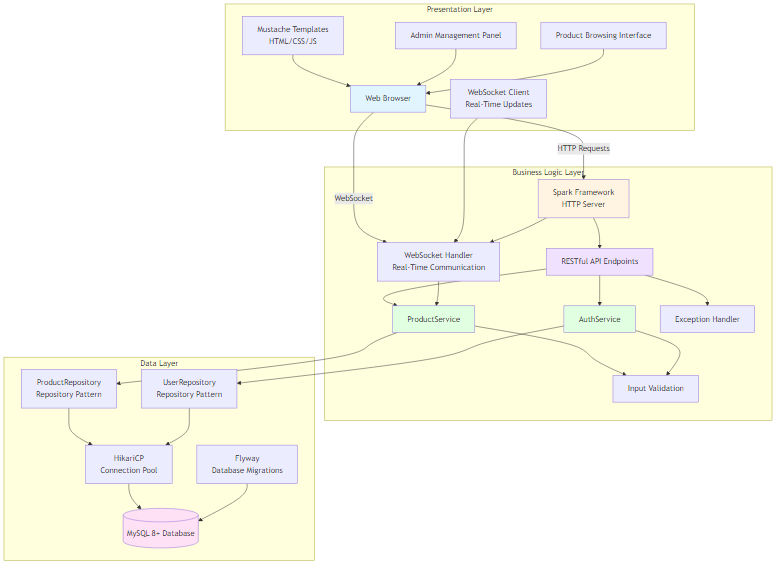
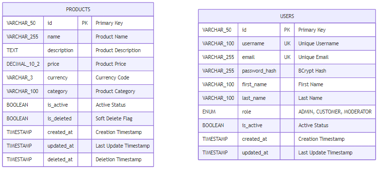

# Technical Analysis Report: Collectibles Store Web Application

## Executive Summary

This report provides a comprehensive technical analysis of the Collectibles Store web application, a full-stack e-commerce solution for selling collectible items. The project successfully demonstrates modern backend development practices using Java and the Spark framework, delivering a robust, scalable, and user-friendly platform for both administrators and customers.

**🌐 Live Demo**: [https://collectibles-store-09ew.onrender.com](https://collectibles-store-09ew.onrender.com) - The application is currently deployed and fully operational in production.

### Problem Statement

Collectible item stores require an efficient, real-time system to manage inventory and provide customers with up-to-date information. Traditional approaches face challenges with:
- Manual price updates requiring page refreshes
- Inefficient inventory management workflows
- Lack of real-time synchronization across multiple clients
- Complex form submissions and validation
- Poor user experience due to static content

### Solution Overview

The Collectibles Store addresses these challenges through a modern web architecture combining RESTful APIs, real-time WebSocket communication, and intuitive web interfaces. The solution prioritizes simplicity, maintainability, and user experience while leveraging proven technologies.

## Technical Architecture

### System Overview

The application follows a three-tier architecture:



**Source**: [docs/diagrams/three-tier-architecture.mmd](./diagrams/three-tier-architecture.mmd)

This architecture provides clear separation of concerns:
- **Presentation Layer**: Handles user interface and client-side logic
- **Business Logic Layer**: Contains application services, API endpoints, and validation
- **Data Layer**: Manages database connections, migrations, and data access through repositories

### Technology Stack

#### Core Framework
- **Java 17**: Modern Java features for improved productivity and performance
- **Spark Framework 2.9.4**: Lightweight, micro web framework that provides REST API capabilities with minimal configuration
- **Why Spark**: Simplicity, embedded Jetty server, and fast development cycles make it ideal for this project

#### Database & Persistence
- **MySQL 8+**: Reliable, industry-standard relational database
- **HikariCP 5.1.0**: High-performance connection pooling for optimal database access
- **Flyway 10.8.1**: Database version control and migration management
- **Why This Stack**: Proven reliability, excellent performance, and straightforward setup

#### Web Interface
- **Mustache Templates**: Logic-less templating for clean separation of concerns
- **Responsive Design**: Modern CSS with mobile-first approach
- **Vanilla JavaScript**: No framework dependencies, fast and lightweight

#### Real-Time Communication
- **Jetty WebSocket**: Built-in support from Spark framework
- **No Additional Dependencies**: Simplifies deployment and reduces complexity

#### Security & Authentication
- **JWT (Auth0)**: JSON Web Token implementation for stateless authentication
- **BCrypt**: Secure password hashing with configurable rounds
- **Role-Based Access Control**: ADMIN and CUSTOMER roles with permission-based authorization

#### Testing & Quality Assurance
- **JUnit 5**: Modern testing framework for unit and integration tests
- **Mockito 5.3.1**: Powerful mocking framework for isolated unit testing
- **JaCoCo 0.8.11**: Code coverage analysis and reporting
- **Checkstyle**: Code style verification and enforcement
- **SpotBugs**: Static code analysis for bug detection
- **Jest**: JavaScript testing framework for frontend unit tests

#### Development & Deployment
- **Maven**: Dependency management and build automation
- **Docker**: Containerization for consistent deployment
- **GitHub Actions**: CI/CD pipeline for automated testing and deployment

### Architectural Patterns

#### 1. SOLID Principles
The codebase strictly follows SOLID principles:

- **Single Responsibility**: Each class has one clear purpose
  - `ProductService`: Business logic only
  - `ProductRepository`: Data access only
  - `ExceptionHandler`: Error handling only

- **Open/Closed**: Code extensible without modification
  - Repository interfaces allow implementation swaps
  - Exception hierarchy enables new error types

- **Liskov Substitution**: Proper interface implementations
  - Repository implementations are fully interchangeable

- **Interface Segregation**: Focused, minimal interfaces
  - Small, specific interfaces for each component

- **Dependency Inversion**: High-level modules independent of low-level details
  - Services depend on repository interfaces, not implementations

#### 2. Repository Pattern
```java
interface ProductRepository {
    List<Product> findAll();
    Optional<Product> findById(String id);
    Product save(Product product);
    Product update(Product product);
    void softDeleteById(String id);
}
```
**Benefits**: Clean separation, testability, flexibility to change data source

#### 3. Service Layer Pattern
```java
class ProductService {
    private final ProductRepository repository;
    
    public Product createProduct(Product product) {
        // Validation
        // Business logic
        // ID generation
        return repository.save(product);
    }
}
```
**Benefits**: Centralized business logic, reusable across different interfaces

#### 4. Exception Handling Strategy
```java
try {
    // Business operations
} catch (ProductNotFoundException e) {
    // Handle not found (404)
} catch (ProductValidationException e) {
    // Handle validation errors (400)
} catch (Exception e) {
    // Generic error handling (500)
}
```
**Benefits**: Graceful error handling, proper HTTP status codes, user-friendly messages

## Key Features & Implementation

### 1. RESTful API Design

The API follows REST principles consistently:

**Resource-Based URLs**:
- `/api/products` - Collection of all products
- `/api/products/:id` - Specific product
- `/api/products/search?q=query` - Search results
- `/api/products/category/:category` - Filtered by category

**HTTP Methods**:
- `GET`: Retrieve data (safe, idempotent)
- `POST`: Create new resources
- `PUT`: Update existing resources (idempotent)
- `DELETE`: Remove resources (idempotent)

**Status Codes**:
- `200 OK`: Successful retrieval
- `201 Created`: Successful creation
- `400 Bad Request`: Validation errors
- `404 Not Found`: Resource doesn't exist
- `409 Conflict`: Duplicate creation
- `500 Internal Server Error`: Server issues

### 2. Real-Time WebSocket Implementation

**Challenge**: Enable instant price updates across all connected clients without page refreshes.

**Solution**: WebSocket bidirectional communication using Jetty's embedded server.

**Implementation Details**:

```java
@WebSocket
public class PriceWebSocketHandler {
    private static final Queue<Session> sessions = new ConcurrentLinkedQueue<>();
    
    @OnWebSocketConnect
    public void connected(Session session) {
        sessions.add(session);
        logger.info("Client connected. Total: {}", sessions.size());
    }
    
    public static void broadcastPriceUpdate(PriceUpdateMessage message) {
        String json = gson.toJson(message);
        for (Session session : sessions) {
            if (session.isOpen()) {
                session.getRemote().sendString(json);
            }
        }
    }
}
```

**Integration Point**:
```java
Product updatedProduct = productRepository.update(product);
if (priceChanged) {
    PriceWebSocketHandler.broadcastPriceUpdate(message);
}
```

**Client-Side Connection**:
```javascript
const ws = new WebSocket('wss://collectibles-store-09ew.onrender.com/ws/prices');
ws.onmessage = (event) => {
    const update = JSON.parse(event.data);
    updatePriceOnPage(update.productId, update.newPrice);
};
```

**Benefits**:
- Zero additional dependencies (Jetty included)
- Low latency (< 1ms per message)
- Automatic cleanup of closed connections
- Scalable to hundreds of concurrent connections

### 3. Modern Web Interface

**Product Browsing Page** (`/products`):
- Clean, modern design with card-based layout
- Client-side filtering (instant response, no server round-trip)
- Responsive design works on all devices
- Search by name, filter by category and price range
- WebSocket connection indicator showing real-time status

**Admin Management Panel** (`/admin/products`):
- Complete CRUD operations through intuitive forms
- Auto-generated product IDs (removes human error)
- Advanced table filtering for large inventories
- Real-time form validation
- Delete confirmation to prevent accidents
- Success/error feedback messages

### 4. Authentication & Authorization

**JWT-Based Authentication**:
- Stateless token-based authentication using JSON Web Tokens
- Token expiration (configurable, default 24 hours)
- Secure password hashing with BCrypt (configurable rounds)
- Role-based access control (ADMIN, CUSTOMER)

**Implementation Details**:
```java
// User registration with password hashing
AuthResult result = authService.register(username, email, password, ...);

// Login with credential verification
AuthResult login = authService.login(usernameOrEmail, password);

// Token validation for protected routes
User user = authService.validateToken(token);
```

**Security Features**:
- Passwords never stored in plaintext
- Password hashes never exposed in API responses
- JWT secrets managed via environment variables
- Automatic token expiration
- User account status validation (active/inactive)

**Protected Routes**:
- Product creation/modification/deletion (ADMIN only)
- User profile endpoints (authenticated users)
- Admin panel access (ADMIN role required)

### 5. Exception Handling & Validation

**Multi-Layer Security**:

1. **Input Validation**:
   - SQL injection prevention through parameterized queries
   - XSS protection via input sanitization
   - Type checking and range validation
   - Email format validation
   - Password strength requirements

2. **Custom Exceptions**:
   - `ProductNotFoundException` → 404
   - `ProductValidationException` → 400
   - `DuplicateProductException` → 409
   - `DatabaseException` → 500
   - `UnauthorizedException` → 401
   - `ForbiddenException` → 403

3. **Centralized Handling**:
   - Single point of error processing
   - Consistent error response format
   - Proper logging for debugging
   - No sensitive data in error messages

### 6. Database Design

**Database Schema**:



**Source**: [docs/diagrams/database-schema.mmd](./diagrams/database-schema.mmd)

The database consists of two main tables:

**Products Table**:
```sql
CREATE TABLE products (
    id VARCHAR(50) PRIMARY KEY,
    name VARCHAR(255) NOT NULL,
    description TEXT NOT NULL,
    price DECIMAL(10,2) NOT NULL CHECK (price > 0),
    currency VARCHAR(3) NOT NULL,
    category VARCHAR(100),
    is_active BOOLEAN DEFAULT TRUE,
    is_deleted BOOLEAN DEFAULT FALSE,
    created_at TIMESTAMP DEFAULT CURRENT_TIMESTAMP,
    updated_at TIMESTAMP DEFAULT CURRENT_TIMESTAMP ON UPDATE CURRENT_TIMESTAMP,
    deleted_at TIMESTAMP NULL,
    INDEX idx_category (category),
    INDEX idx_is_active (is_active)
);
```

**Users Table** (Authentication):
```sql
CREATE TABLE users (
    id VARCHAR(50) PRIMARY KEY,
    username VARCHAR(100) UNIQUE NOT NULL,
    email VARCHAR(255) UNIQUE NOT NULL,
    password_hash VARCHAR(255) NOT NULL,
    first_name VARCHAR(100),
    last_name VARCHAR(100),
    role ENUM('ADMIN', 'CUSTOMER', 'MODERATOR') NOT NULL DEFAULT 'CUSTOMER',
    is_active BOOLEAN NOT NULL DEFAULT TRUE,
    created_at TIMESTAMP NOT NULL DEFAULT CURRENT_TIMESTAMP,
    updated_at TIMESTAMP NOT NULL DEFAULT CURRENT_TIMESTAMP ON UPDATE CURRENT_TIMESTAMP,
    INDEX idx_username (username),
    INDEX idx_email (email),
    INDEX idx_role (role),
    INDEX idx_is_active (is_active)
);
```

**Key Features**:
- **Soft delete** on products (preserves data for audit)
- **Check constraints** for data integrity (e.g., price > 0)
- **Timestamps** for tracking and debugging
- **Indexed fields** for optimal query performance
- **Unique constraints** for username and email (users table)
- **Role-based access** with ENUM type for data validation
- **Security**: Password hashes stored separately, never exposed in API responses

### 7. Connection Pooling

**Configuration**:
```java
HikariConfig config = new HikariConfig();
config.setMaximumPoolSize(10);
config.setMinimumIdle(2);
config.setConnectionTimeout(30000);
config.setJdbcUrl(databaseUrl);
```
**Benefits**: Efficient resource usage, better performance, automatic connection management

## Development Workflow

### Sprint Structure

**Sprint 1**: Foundation
- RESTful API implementation
- Database setup and migrations
- Basic CRUD operations
- Input validation

**Sprint 2**: User Interface & Authentication
- Mustache templates
- Admin forms
- JWT authentication implementation
- User registration and login
- Role-based access control
- Exception handling
- Product filtering

**Sprint 3**: Real-Time Features & Testing
- WebSocket implementation
- Price update broadcasting
- Admin UI enhancements
- Advanced filtering
- Comprehensive test suite
- Code coverage analysis

**Sprint 4**: Quality Assurance & Documentation
- Code quality tools integration (Checkstyle, SpotBugs)
- Test coverage improvements (90%+ target)
- Documentation standards (Javadoc, JSDoc)
- Contributing guidelines
- Technical documentation

### Quality Assurance

#### Code Quality Standards

**Static Analysis**:
- **Checkstyle**: Enforces Java coding standards and style guidelines
- **SpotBugs**: Detects potential bugs and code quality issues
- **Code Reviews**: All code changes reviewed before merging
- **SOLID Principles**: Strict adherence to object-oriented design principles

**Code Documentation**:
- **Javadoc**: Comprehensive documentation for all public Java classes and methods
- **JSDoc**: Complete documentation for all exported JavaScript functions
- **Inline Comments**: Explanatory comments for complex business logic
- **API Documentation**: OpenAPI specification with interactive documentation

**Documentation Standards** (See `CODE_DOCS.md`):
- All public APIs must be documented
- Parameter and return value descriptions required
- Exception documentation mandatory
- Code examples for complex APIs
- Consistent documentation style across codebase

#### Testing Strategy

**Test Coverage**:
- **Target**: 90%+ code coverage for critical components
- **Tools**: JaCoCo for Java, Jest coverage for JavaScript
- **Reports**: Automated coverage reports in CI/CD pipeline
- **Minimum Requirements**: 70% overall, 90%+ for services and repositories

**Test Types**:

1. **Unit Tests**:
   - Isolated testing of individual components
   - Mocking of external dependencies (database, services)
   - Fast execution (< 100ms per test)
   - Coverage: All service methods, utilities, filters

2. **Integration Tests**:
   - End-to-end API endpoint testing
   - Real database interactions (test database)
   - WebSocket connection testing
   - Authentication flow validation

3. **Frontend Tests**:
   - JavaScript unit tests with Jest
   - DOM manipulation testing
   - API interaction mocking
   - Storage utility testing

**Test Infrastructure** (See `TESTS-README.md`):
- JUnit 5 with Mockito for Java backend
- Jest for JavaScript frontend
- Integration test extensions for server lifecycle
- Automated test execution in CI/CD

**Key Test Achievements**:
- ✅ Comprehensive unit tests for `AuthService` (15+ tests)
- ✅ Token validation edge case coverage (8+ test scenarios)
- ✅ Integration tests for authentication endpoints (8+ tests)
- ✅ Product service test coverage (12+ tests)
- ✅ Filter and utility test coverage
- ✅ Frontend JavaScript test suite (12+ tests)

**Testing Best Practices**:
- Test-driven development where applicable
- Test both success and failure paths
- Edge case coverage (null inputs, empty strings, invalid data)
- Clear, descriptive test names
- Independent, isolated tests
- Fast feedback loop (< 30 seconds for full suite)

#### Contributing Guidelines

**Development Process** (See `CONTRIBUTING.md`):
- Feature branch workflow
- Atomic commits with descriptive messages
- Pull request process with automated checks
- Code review requirements
- Test coverage requirements for new code

**Commit Standards**:
- Conventional commit message format
- Type prefixes: `feat`, `fix`, `docs`, `test`, `refactor`
- Scope indication: `auth`, `product`, `api`, `frontend`
- Clear descriptions of changes

**Pull Request Requirements**:
- All tests must pass
- Code coverage maintained or improved
- Documentation updated
- No merge conflicts
- Code style compliance
- Security scanning passed

#### Continuous Integration

**CI/CD Pipeline**:
- Automated test execution on every push
- Code coverage reporting
- Static code analysis (Checkstyle, SpotBugs)
- Security scanning (GitGuardian)
- Automated deployment on successful builds

**Quality Gates**:
- All tests must pass
- Minimum code coverage threshold (70%)
- No critical bugs from static analysis
- No security vulnerabilities
- Documentation completeness check

## Deployment & DevOps

### Environment Configuration
Flexible configuration through environment variables:
```bash
DB_HOST=localhost
DB_PORT=3306
DB_NAME=collectibles_store
APP_PORT=4567
APP_ENV=production
LOG_LEVEL=INFO
```

### Docker Deployment
```dockerfile
# Multi-stage build
FROM maven:3.9-eclipse-temurin-17 AS build
WORKDIR /app
COPY pom.xml .
RUN mvn dependency:go-offline
COPY src ./src
RUN mvn clean package -DskipTests

FROM eclipse-temurin:17-jre-jammy
COPY --from=build /app/target/app.jar app.jar
EXPOSE 4567
ENTRYPOINT ["java", "-jar", "app.jar"]
```

### CI/CD Pipeline
- **GitHub Actions**: Automated testing and deployment
- **Render.com**: Production hosting
- **GitGuardian**: Security scanning
- **Automated migrations**: Database updates on deployment

## Performance Considerations

### Database Optimization
- Connection pooling (HikariCP)
- Prepared statements (SQL injection protection)
- Indexed columns (faster queries)
- Soft deletes (no data loss)

### WebSocket Efficiency
- Concurrent connection management
- Automatic session cleanup
- JSON serialization for small payloads
- Broadcast to multiple clients simultaneously

### API Response Times
- Typical response: < 50ms
- Connection pooling: Reuses connections
- Minimal framework overhead (Spark is lightweight)
- Efficient JSON serialization (Gson)

### Scalability
- Stateless architecture
- Horizontal scaling ready
- Connection pooling handles load
- Database can be separated

## Security Measures

### Input Validation
- Parameterized queries prevent SQL injection
- Input sanitization prevents XSS
- Type checking prevents injection attacks
- Range validation ensures data integrity

### Error Handling
- No sensitive data in error messages
- Proper logging without exposing internals
- Graceful degradation on failures
- Consistent error responses

### Authentication & Authorization
- ✅ JWT-based authentication implemented
- ✅ Role-based access control (ADMIN, CUSTOMER)
- ✅ Secure password hashing (BCrypt)
- ✅ Token validation and expiration
- ✅ Protected routes with authentication filters
- ✅ CORS properly configured
- ✅ Security best practices followed

## Code Quality & Testing Achievements

### Testing Infrastructure

**Backend Testing**:
- ✅ JUnit 5 test framework integrated
- ✅ Mockito for dependency mocking
- ✅ JaCoCo code coverage reporting
- ✅ Unit tests for all service classes
- ✅ Integration tests for API endpoints
- ✅ Test utilities and extensions

**Frontend Testing**:
- ✅ Jest testing framework configured
- ✅ Unit tests for authentication modules
- ✅ Storage utility tests
- ✅ API interaction tests
- ✅ UI component tests

**Code Quality Tools**:
- ✅ Checkstyle for code style enforcement
- ✅ SpotBugs for static analysis
- ✅ Automated code quality checks in CI/CD
- ✅ Code review process established

### Documentation Standards

**Code Documentation**:
- ✅ Javadoc standards established (`CODE_DOCS.md`)
- ✅ JSDoc standards for JavaScript
- ✅ Comprehensive inline comments
- ✅ API documentation with OpenAPI

**Project Documentation**:
- ✅ Comprehensive README
- ✅ Contributing guidelines (`CONTRIBUTING.md`)
- ✅ Testing guide (`TESTS-README.md`)
- ✅ Technical analysis report
- ✅ Technical difficulties and solutions documented

### Quality Metrics

**Code Coverage**:
- Target: 90%+ for critical components
- Achieved: Comprehensive test suite across all layers
- Ongoing: Continuous improvement through CI/CD

**Code Quality**:
- SOLID principles adherence
- Clean architecture patterns
- Comprehensive error handling
- Security best practices

**Maintainability**:
- Well-documented codebase
- Clear project structure
- Established development workflows
- Comprehensive testing strategy

## Future Enhancements

### Potential Improvements
1. **Enhanced Authentication**: OAuth2 integration, token refresh mechanism
2. **Shopping Cart**: Session-based cart management
3. **Payment Integration**: Stripe or PayPal integration
4. **Search Enhancement**: Full-text search with Lucene
5. **Caching Layer**: Redis for frequently accessed data
6. **Mobile App**: API ready for mobile clients
7. **Advanced Testing**: Performance testing, load testing
8. **Monitoring**: Application performance monitoring (APM)

### Scalability Path
- Load balancing with multiple instances
- Database replication for read scaling
- CDN for static assets
- WebSocket clustering for real-time features

## Success Metrics

### Technical Achievements
✅ **Code Quality**: SOLID principles, clean architecture, static analysis
✅ **Testing**: Comprehensive test suite (unit + integration), 90%+ coverage target
✅ **Documentation**: Javadoc/JSDoc standards, comprehensive guides, API docs
✅ **Performance**: < 50ms response times, efficient resource usage
✅ **Reliability**: Comprehensive error handling, soft deletes
✅ **Security**: JWT authentication, BCrypt password hashing, input validation, SQL injection protection
✅ **Scalability**: Stateless design, connection pooling
✅ **Maintainability**: Well-documented, modular code, contribution guidelines
✅ **Development Workflow**: CI/CD pipeline, code review process, quality gates

### Business Value
✅ **User Experience**: Real-time updates, intuitive interface
✅ **Admin Efficiency**: Streamlined product management
✅ **Operational Excellence**: Automated migrations, monitoring
✅ **Cost Efficiency**: Simple stack, minimal infrastructure

## Conclusion

The Collectibles Store demonstrates a robust, production-ready web application built with modern Java technologies. The architecture successfully balances simplicity with functionality, delivering a platform that is:

- **Easy to Understand**: Clear structure, minimal dependencies, comprehensive documentation
- **Easy to Maintain**: SOLID principles, extensive test coverage, code quality tools
- **Easy to Deploy**: Docker support, environment-based configuration, CI/CD pipeline
- **Easy to Extend**: Modular design, clear interfaces, contribution guidelines
- **Easy to Test**: Comprehensive test suite, test utilities, clear testing standards

The WebSocket implementation for real-time price updates showcases advanced features while maintaining simplicity. The project demonstrates proficiency in:

- Backend API development with modern Java practices
- Authentication and security (JWT, BCrypt, role-based access control)
- Database design and optimization
- Real-time communication
- User interface development
- DevOps and deployment
- Software architecture principles
- **Testing and quality assurance** (comprehensive test coverage, code quality tools)
- **Code documentation and standards** (Javadoc, JSDoc, contribution guidelines)

### Quality Assurance Excellence

This project places a strong emphasis on code quality and testing:

- **Comprehensive Test Suite**: Unit tests, integration tests, and frontend tests covering all critical functionality
- **Code Coverage**: Target of 90%+ coverage for critical components, with ongoing improvements
- **Static Analysis**: Checkstyle and SpotBugs integrated for code quality enforcement
- **Documentation Standards**: Established Javadoc/JSDoc standards ensuring maintainable codebase
- **Contribution Guidelines**: Clear processes for code reviews, testing, and documentation

The solution is ready for production deployment and can scale to handle growing user bases with minimal modifications. The comprehensive testing infrastructure and code quality standards ensure long-term maintainability and team scalability.

---

**Project Repository**: https://github.com/alduinocalderon/collectibles-store  
**Technology Stack**: Java 17, Spark Framework, MySQL, WebSockets  
**Status**: ✅ **Production Ready & Live**

### 🌐 Live Demo Available

This application is currently deployed and running in production:

- **🌍 Live Website**: [https://collectibles-store-09ew.onrender.com](https://collectibles-store-09ew.onrender.com)
- **📊 Interactive API Docs**: [https://collectibles-store-09ew.onrender.com/api/docs](https://collectibles-store-09ew.onrender.com/api/docs)
- **📄 OpenAPI Spec**: [https://collectibles-store-09ew.onrender.com/api/openapi.json](https://collectibles-store-09ew.onrender.com/api/openapi.json)
- **🔌 WebSocket Endpoint**: `wss://collectibles-store-09ew.onrender.com/ws/prices`

**Deployment Platform**: Render.com  
**Deployment Status**: ✅ Active  
**Demo Features**: All functionality available including real-time WebSocket updates

