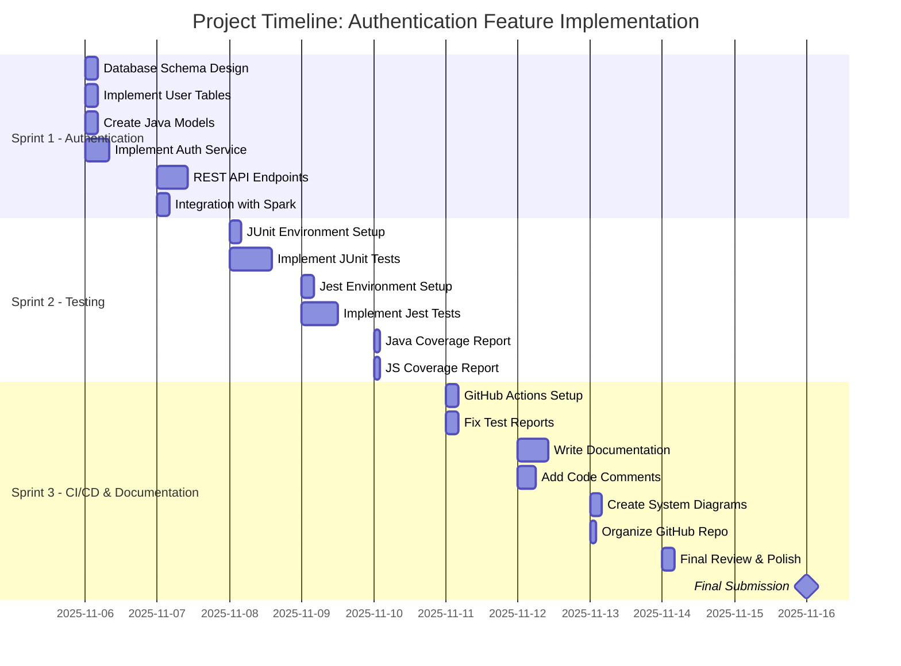

# Project Roadmap: Collectibles Store - Authentication Feature

## Objectives

### General Objective
To enhance the Collectibles Store API by designing, implementing, and testing a secure user authentication system using stored procedures, while following best practices for development on a separate branch to ensure production stability.

### Specific Objectives
1.  **Design and Implement Database Schema:** Create the necessary database tables (e.g., `users`, `roles`) and stored procedures for managing user authentication and metadata.
2.  **Develop Authentication API:** Build the backend logic and RESTful API endpoints in Java for user registration, login, and session management using the Spark framework.
3.  **Ensure Code Quality with Unit Tests:** Implement a comprehensive suite of unit tests with JUnit for the new authentication module, aiming for at least 90% code coverage to guarantee reliability.
4.  **Produce Comprehensive Documentation:** Create detailed documentation for the new feature, including API endpoints, database schema, setup instructions, and maintain a clean, well-organized GitHub repository.

## Timeline and Milestones

### Sprint 1: Authentication Implementation (Nov 6, 2025 - Nov 7, 2025)
-   Finalize the database schema design for user authentication.
-   Implement tables (`users`, etc.) and relationships in the MySQL database.
-   Create Java data models and repositories for the new tables.
-   Develop the RESTful API endpoints for registration, login, and token validation.
-   Integrate the authentication logic with the existing Spark framework application.
-   Work will be done in a new feature branch (e.g., `feature/authentication`).

### Sprint 2: Testing Implementation (Nov 8, 2025 - Nov 10, 2025)
-   Set up JUnit testing environment for backend tests.
-   Write comprehensive unit tests for all services, repositories, and utility classes using JUnit.
-   Set up Jest testing environment for frontend tests.
-   Write comprehensive unit tests for frontend authentication modules using Jest.
-   Verify code coverage for both Java and JavaScript modules.
-   Ensure all tests pass successfully.

### Sprint 3: CI/CD, Documentation, and Finalization (Nov 11, 2025 - Nov 16, 2025)
-   Set up and configure GitHub Actions workflow for automated testing.
-   Fix and improve test reports and coverage reports.
-   Draft complete project documentation for the new authentication feature.
-   Document the API endpoints and testing procedures.
-   Add detailed comments within the code and create system diagrams.
-   Update the main `README.md` to include instructions on the new feature.
-   Organize and finalize the GitHub repository structure.
-   Prepare the feature branch for merging into the main branch.

## Deliverables

### Sprint 1
-   **Database Schema**: SQL scripts for creating new tables.
-   **Feature Branch**: A new branch in the GitHub repository for development.
-   **Java Models and Repositories**: Core Java classes for database interaction.
-   **Authentication API Endpoints**: Functional endpoints for user management.

### Sprint 2
-   **JUnit Test Suite**: A suite of unit tests for the backend authentication module.
-   **Jest Test Suite**: A suite of unit tests for the frontend authentication module.
-   **Code Coverage Reports**: Coverage reports for both Java and JavaScript code.

### Sprint 3
-   **GitHub Actions Workflow**: Automated CI/CD pipeline for testing.
-   **API Documentation**: Detailed documentation of all endpoints and testing procedures.
-   **System Diagrams**: Architecture and flow diagrams.
-   **Updated GitHub Repository**: A clean, well-organized repository with complete documentation.

## Project Gantt Chart

## Technologies and Tools
-   **Java**: Core language for the API.
-   **Spark Framework**: Web framework for building the RESTful API.
-   **MySQL**: Database for storing user and collectibles data.
-   **JUnit**: Framework for unit testing the Java module.
-   **Jest**: Framework for unit testing the JavaScript module.
-   **JaCoCo**: Code coverage tool for Java.
-   **GitHub Actions**: CI/CD pipeline for automated testing.
-   **Git & GitHub**: For version control and repository management.
-   **Render**: Platform where the production environment is hosted.

## Risk Management

| Risk                                     | Impact | Probability | Mitigation Strategy                                                                                             |
| ---------------------------------------- | ------ | ----------- | --------------------------------------------------------------------------------------------------------------- |
| Stored procedures are difficult to debug | Medium | Medium      | Develop procedures incrementally. Ensure comprehensive unit testing of the Java code that calls the procedures. |
| Security vulnerabilities in auth logic   | High   | Medium      | Follow security best practices (e.g., password hashing with bcrypt, secure token generation). Conduct peer reviews. |
| Breaking changes to the existing API     | High   | Low         | Develop entirely on a separate feature branch. Perform thorough integration testing before merging to main.      |
| Delays in API development                | Medium | Medium      | Define a clear contract for the API endpoints and database schema early in Sprint 1. Prioritize core functionality. |