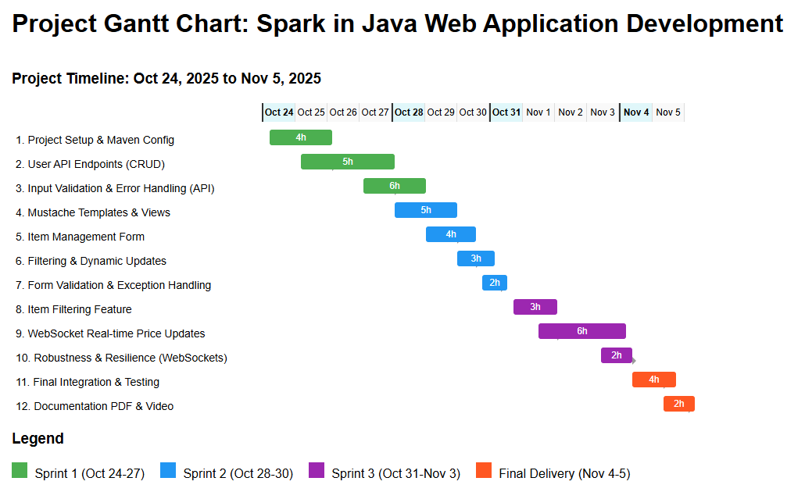

# Project Roadmap: Spark in Java Web Application Development

## Objectives

### General Objective
Develop a fully functional web application for selling collectible items using Java and the Spark framework, demonstrating modern backend development practices and delivering a seamless user experience.

### Specific Objectives
1. Design and implement a RESTful API for user and item management using Java Spark.
2. Develop dynamic web views and templates for the online store, ensuring usability and proper error handling.
3. Integrate advanced features such as item filtering and real-time price updates using WebSockets.
4. Deliver a complete, robust, and well-documented system, including a technical analysis and video presentation.

## Timeline and Milestones

### Sprint 1 (Oct 24 to Oct 27)
- Set up project repository and Maven configuration.
- Implement Spark-based API with basic user operations (GET, POST, PUT, DELETE).
- Define API routes and handle requests for user management.
- **Milestones:**
  - Project scaffolding and initial commit.
  - API endpoints for user CRUD operations tested.

### Sprint 2 (Oct 28 to Oct 30)
- Develop Mustache templates and frontend views for the website.
- Implement exception handling for user interactions.
- Create and connect a form to manage item offers.
- **Milestones:**
  - User-facing forms and views functional.
  - Exception handling and feedback implemented.

### Sprint 3 (Oct 31 to Nov 3)
- Implement item filtering features.
- Add real-time price updates for items using WebSockets.
- Finalize all features and ensure system integration.
- **Milestones:**
  - Item filter and WebSocket updates integrated.
  - System passes integration tests.

### Final Delivery (Nov 4-5)
- Integrate all sprints into a cohesive web application.
- Prepare technical analysis and results PDF.
- Record demonstration and results video (MP4).
- **Milestones:**
  - Final system delivered and deployed.
  - Documentation and video submitted.

## Deliverables

### Sprint 1
- API service for user management with Spark (Java)
- Configured Maven project
- Route definitions and testing

### Sprint 2
- Dynamic Mustache templates and website views
- Error and exception handling infrastructure
- Item management form

### Sprint 3
- Item filtering functionality
- Real-time price update with WebSockets

### Final Delivery
- Integrated project with all features
- Analysis and results PDF
- Video presentation (MP4)

## Project Gantt Chart

## Technologies and Tools
- Java & Spark: Backend service, routing, and API
- Maven: Dependency management and build automation
- Mustache: Templating engine for web views
- WebSockets: Real-time communication for price updates
- HTML/CSS/JS: Frontend interface and interactivity
- GitHub: Version control and collaboration

## Stakeholders
- Rafael: Lead Developer (implements solution)
- Ramón: Client and collectibles expert (domain requirements)
- Sofía: Technical advisor (provides expert programming guidance)
- Digital NAO Evaluators: Assess final deliverables and presentations

## Risk Management

| Risk | Impact | Probability | Mitigation Strategy |
|------|--------|------------|---------------------|
| Delays in API or WebSocket integration | High | Medium | Allocate buffer days, perform early integration tests |
| Maven or dependency issues | Medium | Medium | Use stable dependencies, maintain backup configuration |
| User interface bugs or usability issues | Medium | Medium | Conduct usability testing after each sprint |
| Incomplete final deliverables | High | Low | Track progress via Gantt, prioritize documentation and video early |
